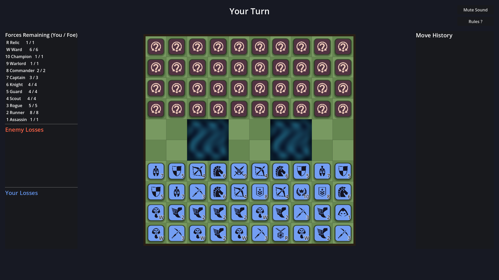

# Mythic Vanguard

A fantasy battle of hidden ranks — a Stratego-inspired strategy board game built in **Godot 4** for the web.



## The Game

Two armies of 40 face off across a 10×10 battlefield split by two impassable chasms. Every enemy piece is hidden until it fights: deploy your army, probe with expendable Runners, deduce where the Wards guard the Relic, and capture it to win.

| Rank | Piece | Count | Special |
|---|---|---|---|
| 10 | Champion | 1 | Strongest — falls only to the Assassin's strike |
| 9 | Warlord | 1 | |
| 8 | Commander | 2 | |
| 7 | Captain | 3 | |
| 6 | Knight | 4 | |
| 5 | Guard | 4 | |
| 4 | Scout | 4 | |
| 3 | Rogue | 5 | The only piece that can disarm Wards |
| 2 | Runner | 8 | Moves any distance in a straight line |
| 1 | Assassin | 1 | Defeats the Champion — but only when attacking |
| W | Ward | 6 | Immobile — destroys any attacker except the Rogue |
| R | Relic | 1 | Immobile — capture the enemy's Relic to win |

Higher rank wins a fight; equal ranks both fall; combat reveals both pieces. The two-square rule prevents endless shuttling, and running out of legal moves loses the game.

## Features

- Heuristic AI with **Easy/Hard** difficulty that plays fair — it only acts on information a human opponent would have
- Deduction aids: revealed ranks stay visible, moved pieces are marked (they can't be Wards), live forces-remaining counts, and a full move history log
- Deployment tray with auto-deploy, randomize, and **3 save/load layout slots**
- Two-click attack confirmation, combat result popups, in-game rules reference
- Sound, music, and a fast-animations option — all settings persist between sessions

## Running It

Open the project in [Godot 4.3+](https://godotengine.org/) and press Play, or from the command line:

```sh
godot --path .
```

### Web export

```sh
godot --headless --export-release Web build/index.html
```

The included `netlify.toml` serves the required Cross-Origin Isolation (COOP/COEP) headers with `build/` as the publish directory.

### Tests

```sh
godot --headless --path . -- --rulestest
```

Asserts the full combat table, the two-square rule, and stalemate detection; exits non-zero on failure. More dev flags (screenshots, AI self-play) are listed in `handoff.md`.

## Credits

Piece icons from [game-icons.net](https://game-icons.net) (CC BY 3.0) and CC0 audio — see [CREDITS.md](CREDITS.md) for full attribution.
